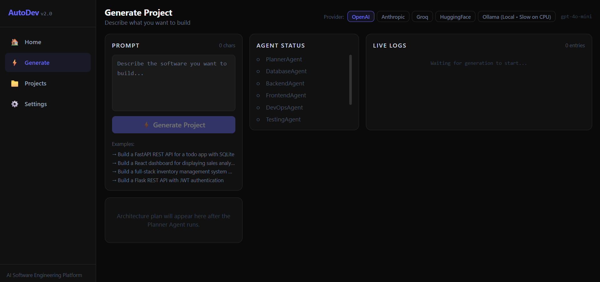
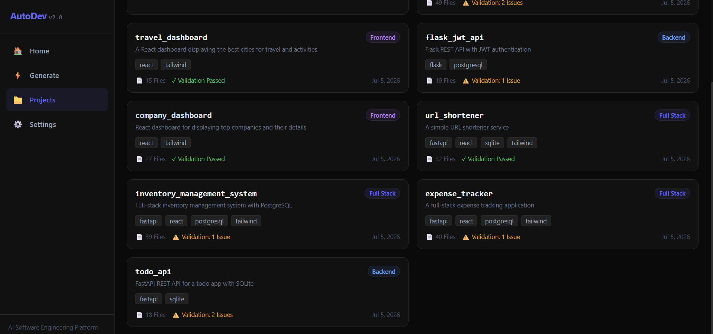
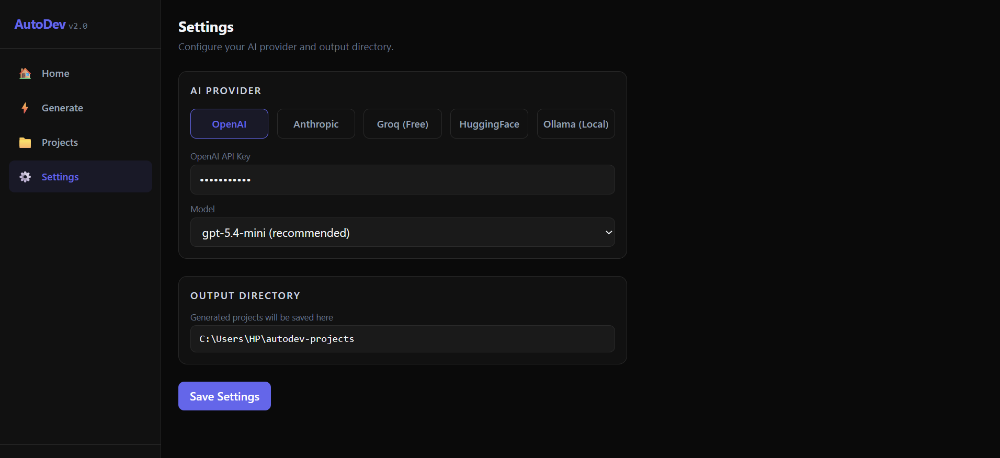

# AutoDev 2.0 — Multi-Agent AI Software Engineering Platform


AutoDev turns a plain-English project description into a scaffolded full-stack
codebase. A prompt like *"Build a URL shortener with Docker support"* is run
through a pipeline of specialized AI agents — Planner, Database, Backend,
Frontend, DevOps, Testing, Documentation — followed by three deterministic,
zero-LLM phases: a syntax Validator, a one-shot Targeted Repair pass, and a
cross-file Consistency Checker that verifies the agents' outputs actually
agree with each other.

> **What this is, honestly:** a multi-agent scaffolding pipeline with strong
> coordination and diagnostics, not a guarantee of production-ready output.
> Every generated project is written to disk with a validation report and a
> consistency report so you can see exactly what (if anything) needs manual
> review — nothing is hidden or silently assumed correct.

## 🚀 Quick Start

Clone the repository and start both the backend and frontend.

```bash
git clone https://github.com/parthj732005/autodev.git
cd autodev

# Backend
cd backend
pip install -r requirements.txt
python -m uvicorn app.main:app --reload

# Frontend (open a new terminal)
cd frontend/autodev-ui
npm install
npm run dev
```

Open your browser at:

```
http://localhost:5173
```

You can also configure your preferred LLM provider from the **Settings** page after launching the application.

> **Recommended:** Use OpenAI, Anthropic, or Groq for the highest-quality generations. Ollama is supported for fully local inference but is typically slower on CPU-only systems.


## Architecture

```
Your prompt
    │
    ▼
PlannerAgent ── produces the authoritative plan: tech stack, api_routes,
    │            entities, environment_variables, docker_entry_point
    ▼
DatabaseAgent ─ owns the canonical SQLAlchemy models (database/models.py)
    │
    ▼
BackendAgent ── implements exactly the API contract from the plan
    │
    ▼
FrontendAgent ─ calls exactly the backend's planned endpoints
    │
    ▼
DevOpsAgent ─── Dockerfile / docker-compose.yml / .env.example using the
    │            plan's exact entry point and env vars
    ▼
TestingAgent ── pytest suite covering every planned route
    │
    ▼
DocumentationAgent ─ README scoped to the real API contract
    │
    ▼
ValidatorAgent ─ static syntax check (ast.parse for Python, bracket-balance
    │             for JS) — catches malformed files, not logic errors
    ▼
Targeted Repair ─ ONE repair attempt per file with a real syntax error (never
    │              a loop). A fix is kept only if independently re-verified;
    │              otherwise the original file is left untouched.
    ▼
ConsistencyChecker ─ pure Python, no LLM calls — verifies frontend calls,
    │                 tests, README, Docker entry point, and requirements.txt
    │                 all agree with what the backend actually implements
    ▼
Project written to disk with validation + repair + consistency reports
```

Every downstream agent receives the same shared "API contract" block (routes,
entities, env vars) that the Planner produces — this is what keeps a
5-file-frontend and a 12-file-backend from silently disagreeing about a route
name or a model shape.

## Key Features

- **5 LLM providers, swappable per generation:** OpenAI, Anthropic, Groq,
  HuggingFace (Inference Router), and Ollama (local, no API key required).
  Model selection genuinely threads through to the real API call — verified
  end-to-end for every provider.
- **Live WebSocket streaming** of every agent's status and log output while a
  project generates, with a project tree, validation report, and consistency
  report shown once it completes.
- **Real cancellation.** Clicking Stop actually cancels the in-flight asyncio
  task and interrupts the pending LLM HTTP request server-side — it doesn't
  just close your browser's side of the socket while the backend keeps
  running in the background.
- **Fail-fast guardrails:** a bad/expired API key or a missing model is
  detected without wasting retries; a bad or unwritable output directory is
  caught before any LLM call runs; a single malformed filename from the LLM
  (a known real failure mode) is skipped instead of losing the rest of the
  generation.
- **Targeted Repair Phase** — after validation, only the files with a real
  syntax error get exactly one LLM-driven fix attempt (never a retry loop).
  A fix is accepted only if it's independently re-verified to actually pass;
  otherwise the original file is kept, untouched, rather than risking a
  worse, unverified rewrite.
- **Same-name collision safety** — regenerating with a project name that
  already exists on disk lands in a fresh `_2`/`_3`/... folder instead of
  silently overwriting or mixing files with the previous project.
- **Project browser** — every generated project persists its plan, files,
  validation report, repair report, consistency report, and full generation
  log, browsable later from the Projects page, plus an "Open in VS Code" button.
- **AI-generated setup instructions** per project, tailored to its actual
  file layout (correctly detects whether the frontend lives at the project
  root or in a subfolder — it does not assume a fixed folder name).

## Getting started

### Prerequisites
- Python 3.10+
- Node.js 20+
- At least one LLM provider: a free [Groq](https://console.groq.com) API key
  is the easiest way to try this without any local setup, or run
  [Ollama](https://ollama.com) locally for a fully offline/free option.

### Backend

```bash
cd backend
pip install -r requirements.txt

# Copy the settings template and add your own key(s)
cp settings.example.json settings.json
# then edit settings.json — set "provider" and the matching "*_api_key"

python -m uvicorn app.main:app --host 127.0.0.1 --port 8000
```

The backend serves on `http://127.0.0.1:8000`. `settings.json` is gitignored
— it holds your real API keys and is never committed.

### Frontend

```bash
cd frontend/autodev-ui
npm install
npm run dev
```

Open the printed local URL (default `http://localhost:5173`).

### Configuration

All configuration lives in `backend/settings.json` (see
`backend/settings.example.json` for the shape). Alternatively, you can
configure everything from the Settings page in the running app — it writes
to the same file.

| Key | Purpose |
|---|---|
| `provider` | Which of `openai` / `anthropic` / `groq` / `huggingface` / `ollama` to use by default |
| `*_api_key` | API key for that provider (blank = not configured; the UI will show it as locked) |
| `*_model` | Which model to use for that provider |
| `ollama_base_url` | Where your local Ollama server is running |
| `output_directory` | Where generated projects are written to disk |

**Never commit `backend/settings.json` or any `.env` file** — both are
already gitignored. If you fork this repo, use `settings.example.json` as
your starting point.

## Running the tests

```bash
cd backend
pip install -r requirements-dev.txt
pytest -v
```

The test suite is entirely offline — no API keys or network calls required
(96 tests). It covers the deterministic pieces of the pipeline: the
Consistency Checker's route-matching and entry-point-verification logic, the
Planner's JSON-extraction and default-filling helpers, the Targeted Repair
Phase (one-attempt-per-file, revert-on-failure, never a loop), the structural
backstops in `BackendAgent`/`DevOpsAgent` (flattening a nested layout,
dropping files an agent tried to generate outside its ownership), the
file-writing/cleanup/same-name-collision behavior in `ProjectGenerator`
(including a regression test for a real bug found in production: an LLM
occasionally emits an invalid filename, which must be skipped without losing
the rest of the generated project), and the auth/model-error classification
used to fail fast on a bad API key instead of wasting retries.

CI (`.github/workflows/ci.yml`) runs this test suite plus a frontend
build+lint check on every push and pull request to `main`.

## Known limitations

This project is transparent about what it doesn't do yet, rather than
overstating what it does. These are grounded in an actual, reproducible audit
— not speculation:

- **Validation is syntactic, not semantic — a project can pass every check
  and still fail to boot.** `ast.parse` confirms a file is grammatically
  valid Python; it cannot see an undefined name, a missing import, a relative
  import used from a non-package entry point, or a frontend import path that
  doesn't resolve. A generated project has been confirmed, live, to report
  "0 validation errors, 0 consistency errors" and still throw
  `ImportError`/`NameError` on the very first line executed. **The single
  highest-leverage next feature is an import-resolution check, or a real
  boot test** (`pip install` + `uvicorn`, `npm install` + `vite build`) —
  neither exists yet.
- **The Targeted Repair Phase only fixes syntax errors it can already
  detect** (Python `ast.parse` failures, JS/JSX bracket imbalance). It has no
  visibility into the semantic bugs above, so it cannot fix them.
- **`duplicate_models` matches by class name, not by database table.** Two
  models targeting the same `__tablename__` under different class names
  (e.g. a canonical `Planet` and a rogue `PlanetModel` for the same table)
  are a genuine conflict but are not flagged, because the check only compares
  class names for exact duplicates.
- **Generation quality varies by prompt complexity and by model.** Narrow,
  single-purpose prompts tend to come out clean; prompts that bundle many
  subsystems (auth + payments + admin dashboard + analytics, for example)
  are more likely to hit LLM token-limit truncation or incomplete
  `requirements.txt` generation. Smaller/local models (e.g. HuggingFace's
  free-tier 7B coder model, or a small local Ollama model) have been observed
  to produce messier, less-consistent file structures than larger models
  (GPT-4-class, Claude, Groq's 70B Llama) on the same prompt.

## 🖥️ Application Walkthrough

The screenshots below illustrate the complete workflow, from configuring an LLM provider to generating, validating, repairing, and managing AI-generated software projects.


## Home

The landing page introduces the multi-agent architecture, supported LLM providers, and the end-to-end software generation workflow.

📄 [Home Page](screenshots/HomePage.pdf)

---

## Generate

Create projects from natural-language prompts while monitoring each agent's progress through live logs, validation results, automatic repair, and consistency analysis.



📄 [Detailed Generation Example](screenshots/GeneratePage2.pdf)

---

## Projects

Browse previously generated projects along with their technology stack, validation status, and generated file statistics.



---

## Project Details

Inspect an individual project with generated setup instructions, file tree, validation report, consistency analysis, and generation logs.

📄 [Flask JWT API Example](screenshots/Projects2.pdf)

📄 [Notes Maker Example](screenshots/Project3.pdf)

---

## Settings

Configure LLM providers, API keys, model selection, and the output directory for generated projects.




## License

MIT — see [LICENSE](LICENSE).
